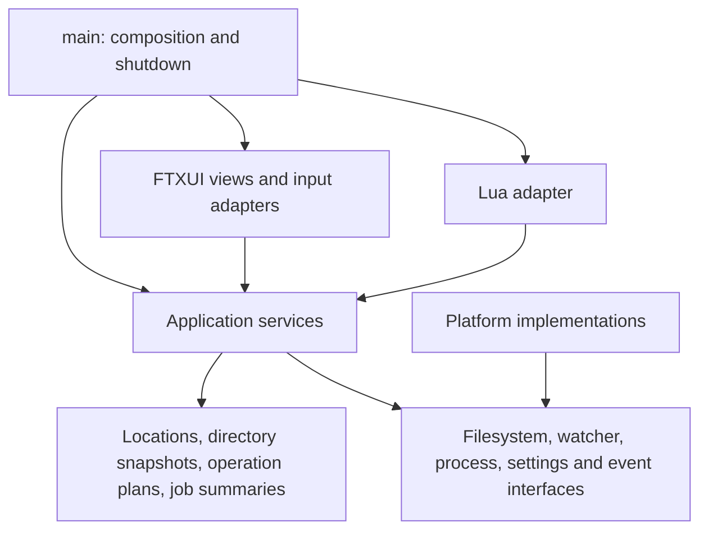

# Architecture and mechanism review — 2026-09-27

Reviewed revision: `35f004e491907a69ea8c4aeb88e6b2e6e8282a47`, after the R01–R37 repair series. Local FTXUI revision: `ff94e7a1008d41e11ce040702654eed6aff1e52c`.

Implementation update: AR01–AR09 are now implemented. This review preserves the original evidence and proposals; [implementation progress](architecture_progress_2026-09-27.md) records each planned solution, applied solution, differences and validation. See [build boundaries](build_boundaries.md) for the current structure and contracts.

The project has useful mechanisms to build on: cancellable operation execution, owned staging outputs, asynchronous directory loading, watcher generations, virtualized lists, and Lua integration tests. The main architectural weakness is that ownership, operation semantics, and view state cross module boundaries without a common application contract. This produces observable failures when otherwise working mechanisms interact.

This review records **nine findings**: five high-priority correctness/scaling problems and four medium-priority structural/resource problems. Four functional failures and a substantial UI latency problem were reproduced. These are additional findings against the current implementation; the previous review's test results remain historical evidence for its narrower cases. No production code was changed for this review.

## Findings at a glance

“High” means address in the next repair cycle because current behavior is affected. “Medium” means an established structural or resource problem with a concrete improvement path. These are architecture priorities, not the P1/P2 severity labels from the earlier defect review.

| ID | Priority | Finding | Evidence |
| --- | --- | --- | --- |
| AR01 | High | UI delivery has no lifetime independent of terminal ownership | Lost completion reproduced during `WithRestoredIO` |
| AR02 | High | Directory snapshots overwrite current view/settings state | Both restored sort orders lost after initial publication |
| AR03 | High | Traversals have inconsistent link and cycle policies | Find scanned one real directory 135 times through two links |
| AR04 | High | Background work still publishes unbounded work on the UI thread | Selection restoration: 2.31 s at 1,000 entries; 9.29 s at 2,000 |
| AR05 | Medium | Jobs, events, search results and archive caches lack retention budgets | Source trace; no long-session exhaustion test |
| AR06 | Medium | Operation machinery depends on widgets, global services and overloaded data records | Source/API trace |
| AR07 | High | Archive locations are represented as disposable filesystem paths | Saved archive identity absent; bookmark lost after cleanup |
| AR08 | Medium | Command execution and event semantics are duplicated across entry points | Registry, shortcuts, palette and Lua source trace |
| AR09 | Medium | Build targets and file structure do not enforce the intended boundaries | Source inventory and CMake/test dependency trace |

## Current mechanisms and ownership

| Mechanism | Current owner and flow | Assessment |
| --- | --- | --- |
| Startup and terminal lifecycle | `main.cpp` installs FTXUI, constructs `FileCommander`, loads settings, runs UI/Lua and shuts down jobs | Installing the loop before workers fixes initial delivery; temporary terminal suspension still drops delivery (AR01). Settings restoration follows worker launch (AR02). |
| Panels, tabs, sorting and selection | `Panel` owns `Dir`, tab copies, `PanelSharedState`, dialogs, watcher and `LatestWork` | Generation/lifetime checks are useful. Filesystem data and view state share one mutable `Dir`, and active tabs duplicate that state (AR02/AR04). |
| Navigation and watcher reconciliation | One active scan plus one replaceable pending request per panel; watchers queue changes and trigger asynchronous full scans | Pending work is bounded. Every relevant ordinary change currently causes a full rescan, followed by expensive UI reconciliation (AR04). |
| Copy planning and confirmation | `CopyDialog` owns `CopyDiscoveryProcess`, which owns both traversal state and preview widgets; confirmation transfers a finished plan | Immutable worker inputs and explicit transfer are improvements. Planning remains coupled to FTXUI and encodes instructions as `DirItem` (AR06). |
| Copy/move/delete/archive jobs | `ThreadedFileJobs` owns one FIFO worker, progress monitor, history, errors and transition records | Serial execution is understandable; owned staging and checkpoint cancellation should be retained. Pause occupies the single worker. Public mutable job objects and unbounded history complicate ownership (AR05/AR06). |
| Small filesystem mutations | Mkdir and batch rename execute directly in dialog callbacks | They bypass the main job service's execution/result contract and can block on filesystem calls (AR06). |
| Search | `FindDialog` owns a BFS worker, queue, results and cancellation flag | Traversal semantics differ from copy/delete; directory links are followed without cycle detection (AR03). |
| Archives | `ArchiveService` owns extraction roots; `Panel` separately owns an archive navigation stack | Exclusive extraction ownership and read-only checks are useful. Durable identity and cache lifetime need explicit representations (AR05/AR07). |
| Editor, clipboard and external tools | `EditorManager`, archive-local process code and `push_to_clipboard` each manage their own invocation path | Editor terminal handoff, archive process-group cancellation and clipboard pipe handling have distinct requirements. A shared process result/ownership contract would support AR01/AR06 while keeping those modes explicit. |
| Commands, palette and key bindings | Global `Commands` metadata, keys in `Theme`, panel handlers and two global dispatch paths | Binding updates are transactional. Execution and availability remain duplicated (AR08). |
| Lua automation | UI-thread coroutine, timer thread, callbacks plus state polling and direct dialog inspection | Same-thread UI access and reliable failure exits are useful. Lua knows concrete dialog internals and reconstructs some domain events (AR08). |
| Settings, bookmarks and theme | Parsing, file I/O and state application live in `app.hpp`; theme and commands are globals | Persistence has no independent typed snapshot/store boundary (AR02/AR07/AR09). |
| Build and tests | One application target; regression target recompiles application sources; Python PTY runners test Lua | Existing tests provide a strong starting point. Core/UI separation and standard test registration are missing (AR09). |

## Detailed findings

### AR01 — Give UI delivery an application lifetime independent of FTXUI installation

**High; reproduced.** Sources: [main.cpp:56](../main.cpp#L56), [main.cpp:63](../main.cpp#L63), [app.hpp:463](../app.hpp#L463), [editor_manager.cpp:140](../editor_manager.cpp#L140). Dependency behavior: local `alex_ftxui/src/ftxui/component/screen_interactive.cpp`, lines 447–454, 559–564 and 968–970.

The production `ExecuteOnUiThread` callback stores the completion only through `screen.Post`. FTXUI drops posts while its sender is absent. `WithRestoredIO` uninstalls the screen, invokes the foreground function, then installs it again. A directory or archive worker completing during that interval loses its publication callback, including the transition that clears `_loading`. Returning from Fresh does not replay it. The logging adapter also uses `WithRestoredIO`, although its suspension window is usually shorter.

The probe started a scan, held it until the terminal was suspended, then let it finish and post. After restoring the screen and running ten event passes, `loading=1` and the new path had not been published. This exercised the actual FTXUI handoff mechanism with a controlled reader; it did not require a real Fresh session.

**Recommended change:** let an application-owned dispatcher retain completion messages independently of screen activation. Use FTXUI posting as a wake-up signal, drain the retained queue on the UI thread after resumption, and keep the existing lifetime/generation checks at application time. Define explicit active, suspended and closing behavior. Worker code should receive a dispatcher/event sink rather than obtaining `ScreenInteractive::Active()` itself.

**Acceptance:** finish directory loading, archive extraction and a job during a suspended-terminal interval; resume with every surviving request applied once. Repeat with panel destruction and superseded navigation to verify stale messages are discarded safely.

### AR02 — Separate directory contents from current view state and settings restoration

**High; reproduced.** Sources: [main.cpp:73](../main.cpp#L73), [app.hpp:437](../app.hpp#L437), [app.hpp:481](../app.hpp#L481), [app.hpp:950](../app.hpp#L950), [app.hpp:973](../app.hpp#L973), [dialogs.cpp:334](../dialogs.cpp#L334).

Panel construction launches initial loads before `load_settings`. A load copies `dir.order_by` into its worker result; publication later replaces the whole `Dir`. Settings or a user sort change made while the request is running therefore gets replaced by the captured earlier order. Generation checks identify the navigation request, but do not distinguish newer view preferences.

The probe loaded `TIME_DESC` and `SIZE_DESC` from an isolated settings file while initial publications were queued. Both values were correctly applied by `load_settings`, then both became `NAME_ASC` when those publications were processed. The same ownership pattern affects a sort action during a refresh.

The persistence boundary also needs strengthening: `app.hpp` contains a hand-written JSON parser and writes settings directly with truncation at [app.hpp:1069](../app.hpp#L1069), without a validated replacement transaction. The emitted version is not used to select a migration on load. These are source-established persistence limitations; interruption/corrupt-file cases were not fault-injected in this review.

**Recommended change:** keep ordering, filtering, selection and focus in UI-owned `PanelViewState`; return filesystem entries and location identity in `DirectorySnapshot`. Publish against the latest view state. Parse and validate an `AppSettings` value before launching initial navigation, then apply it coherently. Put serialization in a `SettingsStore` with checked temporary-file replacement and an explicit version policy.

**Acceptance:** restore all supported sort orders on cold startup; change sort during a delayed refresh and retain the newer choice; preserve the previous settings file on a failed save; report invalid settings without partially applying unrelated fields.

### AR03 — Define traversal policy once, with explicit differences between operations

**High; reproduced.** Sources: [dialogs.cpp:1568](../dialogs.cpp#L1568), [dialogs.cpp:1585](../dialogs.cpp#L1585), [dialogs.cpp:1033](../dialogs.cpp#L1033), [file_io_jobs.cpp:512](../file_io_jobs.cpp#L512), [file_io_jobs.cpp:258](../file_io_jobs.cpp#L258).

Copy discovery, delete discovery, cross-device tree copy and Find each implement traversal separately. Delete uses entry status and avoids following links; copy has link policies and a visited-directory check; Find uses followed `entry.status()` and pushes every directory into a BFS queue without a visited identity set.

A fixture containing one ordinary file and two directory symlinks back to its sole directory produced **135 directory scans and 134 matching results for the same file** before the probe stopped the search. A single link may eventually hit the operating system's symlink-depth limit; branching links multiply the work well before that limit. This is not a claim that every cycle runs forever.

**Recommended change:** extract an iterative traversal service with explicit link-following, cycle identity, error, cancellation and result-budget policies. Preserve operation-specific choices: delete should still act on the link itself; Find should either avoid directory links or follow them with cycle detection. Copy planning can retain its own mapping from source entries to destination operations.

**Acceptance:** exercise the same fixture matrix through Find, copy discovery and delete discovery: dangling links, ordinary chains, ancestor cycles, multiple links to one directory, unreadable directories, deep trees and cancellation. Assert each operation's intended policy instead of forcing identical output.

### AR04 — Bound the work performed when results reach the UI thread

**High; reproduced latency and source-established costs.** Sources: [app.hpp:474](../app.hpp#L474), [app.hpp:484](../app.hpp#L484), [app.hpp:584](../app.hpp#L584), [app.hpp:623](../app.hpp#L623), [file_io_jobs.cpp:49](../file_io_jobs.cpp#L49), [dialogs.cpp:1758](../dialogs.cpp#L1758), [dialogs.cpp:2008](../dialogs.cpp#L2008).

Moving I/O to workers does not bound publication/rendering cost. Selection restoration calls `std::find` over all selected paths for every incoming entry: **O(entries × selected entries)**. It then copies the full active directory into tab state. Ordinary watcher changes trigger complete directory scans and repeat this reconciliation.

With a synthetic reader that performs no entry filesystem I/O, the existing macOS arm64 Debug build spent **2,310.92 ms** publishing 1,000 selected entries and **9,289.00 ms** publishing 2,000. A 2,000-entry control with no selection took **0.91 ms**. These are local Debug measurements, not release throughput estimates; the quadratic algorithm is visible directly in the source.

There is a second avoidable cost in job inspection. `JobSpec::snapshot()` deep-copies all instruction items and errors. The JobList renderer rebuilds snapshots for the active job and every retained history job on every render, even though its menu virtualizes visible rows. One synthetic 100,000-item snapshot took approximately **8–9 ms** locally; that cost grows with all retained plans, not just visible rows. The progress bar separately renders while holding the live job mutex ([app.hpp:746](../app.hpp#L746)); the snapshot API has not established a single observation boundary.

**Recommended change:** restore selection through stable entry keys and a hash/set lookup; share immutable entry/plan storage; publish small progress summaries separately from detailed items. Keep one authoritative state per tab. Rebuild job summaries only when their revision changes and retrieve detail on demand. Coalesce watcher bursts and apply worker-produced deltas where appropriate, preserving full rescans for overflow/recovery.

**Acceptance:** benchmark selected and unselected refreshes at increasing sizes; require approximately linear reconciliation and a stated UI budget. Measure JobList rendering against total history size and ensure invisible full plans are not copied per frame. Include watcher bursts during active copying.

### AR05 — Define resource ownership together with retention and capacity limits

**Medium; source-established.** Sources: [file_io_jobs.cpp:334](../file_io_jobs.cpp#L334), [file_io_jobs.cpp:373](../file_io_jobs.cpp#L373), [file_io_jobs.cpp:504](../file_io_jobs.cpp#L504), [file_io_jobs.cpp:865](../file_io_jobs.cpp#L865), [scripting.cpp:253](../scripting.cpp#L253), [scripting.cpp:501](../scripting.cpp#L501), [archive.cpp:184](../archive.cpp#L184), [archive.cpp:288](../archive.cpp#L288).

Completed history retains full `JobSpec` vectors until explicit dismissal. Job transition events are never pruned, even after dismissal; `events_since` scans the entire retained vector for every poll. Lua advances its event cursor without pruning the preceding log. Search results/frontiers and extraction roots also have no configured budget. Archive roots, including obsolete versions, deliberately survive until service destruction to protect users of those paths.

These are reachable lifetime policies, rather than proof of an observed out-of-memory failure. `LatestWork` already bounds pending panel requests; that protection does not extend to retained results and history. The summary/history split proposed in [completed_jobs.md](completed_jobs.md#71-two-tier-storage) remains useful design material, not an implemented guarantee.

**Recommended change:** separate lightweight completed summaries from optionally retained detail; cap both by count/bytes with an explicit policy for errors and cancelled work. Use sequenced event retention with subscriber cursors or an explicit “history expired; resync” result. Give extraction roots reference-counted leases held by panels and jobs, then evict only unreferenced roots under a cache budget. Bound traversal frontiers/results and report truncation or require continuation.

**Acceptance:** run a long session of short jobs, dismiss them and check bounded memory/event polling cost; open multiple archive versions and verify unreferenced versions are reclaimed while active copy-out and browsing leases remain valid.

### AR06 — Make operation plans and results independent of widgets and globals

**Medium; source-established.** Sources: [dialogs.hpp:173](../dialogs.hpp#L173), [dialogs.cpp:949](../dialogs.cpp#L949), [dialogs.cpp:1084](../dialogs.cpp#L1084), [file_io_jobs.cpp:709](../file_io_jobs.cpp#L709), [file_io_jobs.hpp:143](../file_io_jobs.hpp#L143), [file_io_jobs.cpp:23](../file_io_jobs.cpp#L23), [commander.cpp:181](../commander.cpp#L181).

The documented “machinery first, UI as observer” boundary is not enforced:

- `CopyDiscoveryProcess` takes a `CopyDialog*`, creates `Input`/`DBMenu`/`PanelSharedState`, owns traversal and posts directly to the active screen.
- `DirItem` is both a filesystem/view record and an instruction encoding. For a regular-file copy, its path is the source and `symlink_ref` is the destination; for a symlink instruction, its path is the destination and `symlink_ref` is link text; for a directory instruction, its path is the directory to create. `status_error` encodes discovery failure.
- `FileJobs` exposes FTXUI `DataSize` and menu navigation methods for its error store. Job construction installs a screen callback. `Dir::move_to` reports errors through global `file_operations()`.
- The supposedly independent `make_file_jobs()` manager still executes paths that report through the global manager, for example [file_io_jobs.cpp:615](../file_io_jobs.cpp#L615). It is not a fully isolated service instance.
- Mkdir, batch rename and clipboard calls execute from dialog callbacks instead of using a common asynchronous command/result boundary ([dialogs.cpp:438](../dialogs.cpp#L438), [dialogs.cpp:668](../dialogs.cpp#L668), [dialogs.cpp:1340](../dialogs.cpp#L1340)).

This makes new operations depend on undocumented field conventions and forces machinery tests to link presentation dependencies. It also leaves responsiveness/error behavior different for each operation.

**Recommended change:** introduce explicit request/plan records such as `CopyFile`, `CreateDirectory`, `CreateSymlink` and `DiscoveryFailure`, with named source/destination/link-text fields. Separate immutable plans, mutable execution state and read-only summaries. Give planners and executors an injected error/event sink and expose job controls by ID. Adapt summaries to FTXUI `DataSource` in the UI layer. Move small mutations behind the same service boundary while retaining their dialog-specific feedback.

Start with concrete classes and narrow interfaces at actual ownership or platform boundaries; preserve the existing staging/cancellation implementation behind them.

**Acceptance:** construct and execute a copy plan with no FTXUI or Lua linkage, use two isolated job managers without cross-reporting errors, and verify UI and scripted submissions produce the same operation/result representation.

### AR07 — Represent archive locations independently of extraction paths

**High; reproduced persistence failure.** Sources: [app.hpp:443](../app.hpp#L443), [app.hpp:1078](../app.hpp#L1078), [app.hpp:1099](../app.hpp#L1099), [app.hpp:1159](../app.hpp#L1159), [app.hpp:1023](../app.hpp#L1023), [archive.cpp:184](../archive.cpp#L184).

Archive navigation replaces `Dir::path` with the physical extraction root. Logical archive identity survives only in the panel's separate in-memory stack. Settings and bookmarks serialize the physical path, and restore accepts only paths that currently exist. Normal archive service shutdown removes that root.

The probe entered a real fixture archive, bookmarked it and saved settings. The JSON contained the extraction-cache path and did not contain the archive filename. After removing that owned root to simulate normal shutdown cleanup, a fresh application object restored neither the archive view nor the bookmark; the bookmark list was empty.

**Recommended change:** introduce a `Location` value representing either a local directory or an archive file plus internal path, with nesting if nested archives remain supported. Persist that value. Resolve it to an extraction lease for filesystem operations and carry read-only capability information with it. A smaller initial repair can persist the containing archive/parent and explicitly reject ephemeral bookmarks, but should make that behavior visible.

**Acceptance:** save a bookmark inside an archive, close the application, remove/recreate cache contents and reopen it successfully. Test a replaced/missing archive and a nested archive. Verify copy-out still uses a valid physical root while captions and persistence use logical identity.

### AR08 — Expose application commands and events through one contract

**Medium; source-established.** Sources: [dialogs.cpp:2798](../dialogs.cpp#L2798), [app.hpp:1173](../app.hpp#L1173), [app.hpp:1489](../app.hpp#L1489), [app.hpp:1530](../app.hpp#L1530), [scripting.cpp:274](../scripting.cpp#L274), [scripting.cpp:315](../scripting.cpp#L315).

`Commands` centralizes metadata but not execution. Global commands are implemented in both `execute_palette_command` and `handle_global_shortcuts`; key fields are separately mapped by `theme_key_for_command`. Panel palette callbacks synthesize the command's key back into the component tree. Availability checks, usage counting and focus rules consequently live in multiple paths.

Lua adds another layer of reconstruction: it dynamically casts concrete Copy/Find dialogs and inspects their worker fields to detect completion, while selection/focus/progress events are inferred by polling. Job start/completion already has a sequenced service event mechanism, demonstrating a more explicit contract for those transitions. This review does not claim a new missed-event reproduction; the problem is that changing a dialog implementation can change the automation contract.

**Recommended change:** register a command handler and availability predicate with each stable command ID. Route shortcuts, palette execution and semantic Lua commands through the same application dispatcher, retaining raw key injection for UI tests. Publish request-ID-bearing domain events from their owners; let Lua adapt those events rather than inspect dialog internals. Keep key-binding state separate from visual theme colors.

**Acceptance:** invoke each command through shortcuts, palette and semantic API and compare state/result/event behavior, availability and usage accounting. Add a command without editing parallel global dispatch chains. Replace a dialog view without changing its automation event contract.

### AR09 — Enforce boundaries with source files, targets and test entry points

**Medium; source-established.** Sources: [app.hpp:4](../app.hpp#L4), [app.hpp:45](../app.hpp#L45), [dialogs.hpp:4](../dialogs.hpp#L4), [scripting.cpp:3](../scripting.cpp#L3), [CMakeLists.txt:18](../CMakeLists.txt#L18), [CMakeLists.txt:267](../CMakeLists.txt#L267), [CMakeLists.txt:295](../CMakeLists.txt#L295).

`app.hpp` contains **1,685 lines**, including settings codecs, panel workers/watchers, tab state, progress rendering, command routing and application assembly, largely as inline definitions. `dialogs.cpp` contains **2,885 lines**, spanning view construction, operation planning/traversal, search workers and the command catalog. The issue is the combination of responsibilities and public state, not line count alone. Lua includes the whole application implementation to reach those internals.

CMake builds one application target and recompiles nearly all its sources into `fc_review_tests`, linking the same UI and scripting libraries. There is no independently testable core target and no CTest registration. `smoke_lua_suite` runs only three scripts; the broader PTY/negative-control runner is a separate manual entry point. The four configurable sibling source checkouts are not revision-pinned or validated by this repository, so repaired source dependency tracking still does not define a reproducible dependency set.

**Recommended change:** extract narrow headers and `.cpp` implementations along the boundaries below, then encode those dependencies with library targets. First reuse shared compiled sources in application/tests; subsequently make the core target independent of FTXUI/Lua. Register existing native and PTY suites with clear unit/integration/platform labels, configurable binary paths and per-run debug logs. Record/validate supported dependency revisions and build tool versions in a manifest or bootstrap workflow. Preserve separate host tools and target products for cross-builds.

**Acceptance:** core tests build without terminal/editor/Lua dependencies; normal test discovery lists the supported suites; a clean environment can reproduce the declared dependency set; altering a view does not require recompiling inline persistence/operation implementations in all application consumers.

## Proposed structure

The following is a dependency direction and ownership map, not a requirement to create every directory immediately. Existing `ArchiveService`, `EditorManager`, `LatestWork`, watcher implementations and staged copy helpers should be reused behind the appropriate boundaries.

| Area / target | Responsibility | Initial extraction |
| --- | --- | --- |
| `domain` / `fc_core` | Location, entry metadata, typed plans, summaries and error values | Split `DirItem` instruction meanings and view state; keep immutable data reusable |
| `application` / `fc_application` | Panel controller, planners, job manager, commands, events, cache leases and settings application | Move orchestration out of `Panel`/dialogs and inject service instances at startup |
| `platform` / `fc_platform` | Native enumeration/watchers, staged copy primitive, process launch, clipboard and settings file I/O | Wrap the existing implementations with explicit lifetime/result contracts |
| `ui` / `fc_ui` | FTXUI tree, views, dialogs, DataSource adapters and theme | Keep component ownership and visual state here; views issue commands and consume snapshots |
| `scripting` / `fc_lua` | Lua conversion, coroutine scheduling and test helpers | Depend on application commands/events; keep component access in a narrow raw-key test adapter |
| `main.cpp` | Construct dependencies, parse/restore settings, attach UI, run and stop services | Make startup, terminal suspension, resumption and shutdown ordering explicit |

Keep one authoritative owner for each state category: filesystem facts in immutable snapshots; view preferences in panel state; execution state in the job manager; settings on disk through the settings store; physical archive roots through leases. A `shared_ptr` should carry a needed lifetime, rather than grant every consumer mutation access to a service's internals.

## Recommended implementation order

1. **Repair cross-mechanism correctness first:** retained UI delivery (AR01), view-state-safe publication/settings ordering (AR02), explicit Find link policy (AR03), and durable archive locations or an explicit interim persistence policy (AR07). Add the reproductions below as regression cases with each repair.
2. **Put budgets on interactive and retained work:** remove quadratic selection restoration and whole-history frame copies (AR04); add retention, event pruning and archive leases (AR05). State performance budgets and verify scaling before introducing more worker concurrency.
3. **Extract the application contract:** typed operation plans and injected service ownership (AR06), followed by shared command handlers and domain events (AR08). Preserve existing commit/cancellation semantics and the established integration suite during this work.
4. **Make the build enforce the resulting boundaries:** separate implementations/targets, test registration and a dependency manifest (AR09). Update current-behavior docs as each boundary lands; keep historical proposals clearly labeled.

The single job worker is a reasonable current scheduling policy. Increasing parallelism should follow explicit resource, progress and cancellation contracts; it does not resolve the UI publication and ownership problems measured here.

## Validation and scope limits

This was a source/dependency/lifecycle review with focused probes, not another exhaustive per-function review. The mechanism inventory was checked against `spec.md`, `ftxui_notes.md`, the operation/job/testing/build design documents, the previous review, application headers/translation units, and relevant local FTXUI lifecycle code. Vendored libraries and the external editor were not comprehensively audited.

The disposable harness was compiled using `build/compile_commands.json` and linked to the existing application's regression objects/libraries, replacing the test entry point. It used temporary fixtures and isolated `XDG_CONFIG_HOME`. The handoff fixture controlled a reader's completion around real `WithRestoredIO`; it did not launch Fresh. Archive validation used the configured native 7zr and explicitly simulated exit cleanup of its fixture extraction root.

| Probe | Observation |
| --- | --- |
| Scan completion during terminal suspension | Callback posted; after resumption, `loading=1`, new path not published |
| Settings applied before queued initial scan results | Requested `TIME_DESC`/`SIZE_DESC`; neither retained after publication |
| Find through two self-referential directory links | One real directory; 135 scans and 134 results for one file before cancellation |
| Selected directory snapshot publication, 1,000 entries | 2,310.92 ms on UI thread |
| Selected directory snapshot publication, 2,000 entries | 9,289.00 ms on UI thread |
| Unselected directory snapshot publication, 2,000 entries | 0.91 ms on UI thread |
| Full 100,000-item job snapshot | Approximately 8–9 ms, with 100,000 copied instruction items |
| Save archive view/bookmark, then remove its extraction root | Cache path saved, archive identity absent; fresh load restored neither archive nor bookmark |

The initial 10,000-selected-entry timing attempt exceeded the harness's 15-second limit; the completed smaller/control measurements above are the reported evidence. Timings are synthetic Debug-build measurements and were not repeated as a release benchmark. No real user directories, clipboard contents or settings were mutated.

Probe source, build log and observations are retained locally in `/tmp/fc-architecture-review-Eb5Ioh/`. This temporary path is follow-up evidence, not a permanent test dependency. The existing full regression suites were not rerun for this documentation-only review; their earlier results and sanitizer/runtime limits remain recorded in [code_review_2026-09-27.md](code_review_2026-09-27.md#implementation-completion-and-final-validation). No Linux runtime, real network filesystem, long-session exhaustion, real cross-device boundary, real Fresh terminal session or new sanitizer run is claimed here.
